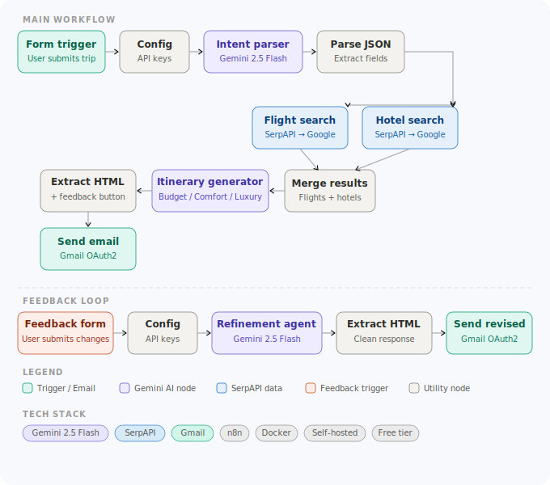

# ✈️ AI Travel Agent

A multi-agent AI system that autonomously searches for flights and hotels, runs a multi-agent debate to generate the best itinerary, and delivers it via email — with a built-in feedback loop for refinements.

## Resources
- [Project One-Pager](AI_Travel_Agent_OnePager.pdf)

## 🏗️ Architecture



## 🤖 Tech Stack

| Component | Technology |
|---|---|
| Orchestration | n8n (self-hosted, Docker) |
| LLM | Google Gemini 2.5 Flash |
| Flight Data | SerpAPI → Google Flights |
| Hotel Data | SerpAPI → Google Hotels |
| Email | Gmail OAuth2 |
| Infrastructure | Docker Desktop |

## ✨ Features

- **Multi-agent debate system** — Budget Agent vs Experience Agent, judged by a Judge Agent
- **Critic Agent** — audits the final itinerary for hidden risks (short layovers, budget overruns, dietary issues)
- **Persona steering** — traveler selects a persona (Budget Backpacker, Family Traveler, Digital Nomad, Luxury Seeker) that dynamically shapes agent recommendations
- **Live flight and hotel data** via SerpAPI
- **Email feedback loop** — users refine itineraries by filling a form
- **Eval suite** — automated two-layer evaluation (deterministic + LLM-graded)
- **100% free stack** — no paid subscriptions required

## 🧠 Multi-Agent Debate Pattern

The core of this project is a multi-agent debate architecture directly applicable to fintech use cases like investment recommendations and risk assessment:

| Agent | Role | Output |
|---|---|---|
| Budget Agent | Optimizes for minimum cost | Cheapest itinerary + BUDGET AGENT VERDICT |
| Experience Agent | Optimizes for best experience | Premium itinerary + EXPERIENCE AGENT VERDICT |
| Judge Agent | Evaluates both, synthesizes best | Final HTML itinerary with verdict |
| Critic Agent | Audits for hidden risks | Risk assessment with HIGH/MEDIUM/LOW ratings |

## 🚀 Setup

### Prerequisites
- Docker Desktop
- Google Gemini API key (free at aistudio.google.com)
- SerpAPI key (free tier at serpapi.com)
- Gmail OAuth2 credentials

### Installation

1. Clone the repo:
```bash
git clone https://github.com/pkgandhi/ai-travel-agent.git
cd ai-travel-agent
```

2. Copy the environment file:
```bash
cp .env.example .env
```

3. Add your API keys to `.env`:
```
GEMINI_API_KEY=your_gemini_key_here
SERPAPI_KEY=your_serpapi_key_here
N8N_BLOCK_ENV_ACCESS_IN_NODE=false
```

4. Start Docker:
```bash
docker compose up
```

5. Open n8n at http://localhost:5678

6. Import the workflow:
   - Go to Workflows → Import
   - Select `workflow.json`

7. Update the Config node with your API keys

8. Activate the workflow and you're ready!

## 📧 How It Works

1. User fills out travel form (origin, destination, dates, budget, travel persona)
2. Gemini parses intent and extracts IATA airport codes
3. SerpAPI fetches live flights and hotels in parallel
4. Budget Agent and Experience Agent generate competing itineraries
5. Judge Agent evaluates both and synthesizes the best final itinerary
6. Critic Agent audits for hidden risks and flags issues
7. Beautiful HTML email sent to user with risk assessment
8. User clicks "Refine My Itinerary" button
9. Feedback form captures change requests
10. Gemini Refinement Agent generates revised itinerary
11. Revised email sent automatically

## 🧪 Evaluation Suite

This project uses a two-layer eval strategy to validate agent output quality — the same pattern used in production ML systems for automated regression testing every time a prompt changes.

### Eval approach

| Type | What it checks | Tool |
|---|---|---|
| Deterministic | Verdict phrases, destination preservation, HTML structure | Python |
| LLM-graded | Persona steering, dietary preferences, risk flagging | Gemini as judge |

### Test cases (7/8 passing — 87%)

| Test | Type | Status |
|---|---|---|
| Budget Agent ends with BUDGET AGENT VERDICT | Deterministic | ✅ Pass |
| Experience Agent ends with EXPERIENCE AGENT VERDICT | Deterministic | ✅ Pass |
| Budget Backpacker → cheap options recommended | LLM-graded | ✅ Pass |
| Digital Nomad → WiFi/co-working mentioned | LLM-graded | ✅ Pass |
| Vegetarian preference → respected in dining | LLM-graded | ✅ Pass |
| Critic Agent → includes HIGH/MEDIUM/LOW risk levels | Deterministic | ✅ Pass |
| Critic Agent → flags 45-min layover as risky | LLM-graded | ❌ Network timeout (not logic failure) |
| Refinement Agent → keeps original destination | Deterministic | ✅ Pass |

### Running the evals

```bash
# Create and activate a virtual environment
python3.12 -m venv ~/travel-agent-evals
source ~/travel-agent-evals/bin/activate
pip install requests

# Run the eval suite
cd evals
export GEMINI_API_KEY=your_key_here
python eval_agents.py
```

Expected output:
```
============================================================
  AI Travel Agent — Eval Suite
  Model: gemini-2.5-flash | Rate limit: 1 req/60s
============================================================
  Running: Budget Agent ends with BUDGET AGENT VERDICT... PASS
  Running: Experience Agent ends with EXPERIENCE AGENT VERDICT... PASS
  ...
  Score: 87%
  Most evals passing — review failures above.
============================================================
```

## 🔑 Environment Variables

| Variable | Description |
|---|---|
| `GEMINI_API_KEY` | Google Gemini API key |
| `SERPAPI_KEY` | SerpAPI key for flights/hotels |
| `N8N_BLOCK_ENV_ACCESS_IN_NODE` | Set to false to allow env vars in n8n |

## 🗺️ Roadmap
- [ ] **Multimodal Vision Agent** — users upload Instagram photos, Gemini Vision identifies the location and builds the itinerary around it
- [ ] **CLI tool** — Python script that triggers the n8n webhook from terminal